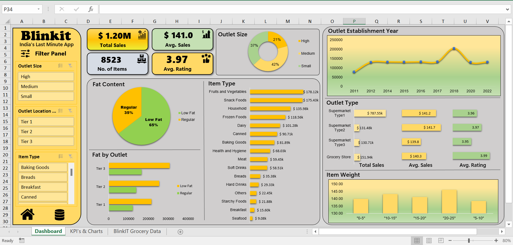

# 📊 Blinkit Sales Dashboard (Excel)

An interactive **Excel Dashboard** built to analyze **Blinkit grocery sales performance** across items, outlets, and customer ratings.  
This project showcases **data cleaning with Power Query, analysis with Pivot Tables, and interactive dashboard design**.

---

## 📸 Dashboard Preview

---

## 🚀 Key Features

This dashboard provides a comprehensive view of **Blinkit sales performance, outlet analysis, and customer insights** with interactive visuals and KPIs.

- **KPI Cards**:
  - 💰 Total Sales  
  - 📊 Average Sales  
  - 📦 Number of Items  
  - ⭐ Average Rating  

- **Charts & Visuals**:
  - 🥤 Sales by Fat Content  
  - 🏪 Fat Content by Outlet  
  - 📦 Sales by Item Type  
  - 🏬 Sales by Outlet Size  
  - 📈 Sales Trend by Establishment Year  
  - ⚖️ Item Weight by Average Sales  
  - 🏪 Outlet Type Performance:
    - 💰 Total Sales  
    - 📊 Average Sales  
    - ⭐ Average Rating  

- **Interactive Filters**:
  - 🎛️ Outlet Size | Location Type | Item Type  

---

## 📈 Insights & Findings

Key business insights derived from the analysis:

1. 🥇 **Low Fat items** generated the **highest total sales**, indicating customer preference for healthier options.  
2. 🏬 **Medium-sized outlets** outperformed small and large outlets in total revenue, suggesting optimal resource utilization.  
3. 📦 **Fruits & Vegetables** and **Snack Foods** were the **top-selling categories**, contributing significantly to total sales.  
4. 📊 Outlets established between **1985–1990** showed **steady sales performance**, indicating consistent brand presence.  
5. ⭐ **Supermarket Type 1 outlets** recorded **higher average ratings** but relatively **lower total sales** compared to Type 2 and Type 3.  
6. ⚖️ A positive correlation was observed between **Item Weight and Average Sales**, suggesting heavier products yield better revenue.

---

## 📂 Project Files

- `Blinkit Grocery Data.xlsx` → Dataset  
- `Blinkit Grocery Dashboard.xlsx` → Final Excel Dashboard  
- `Dashboard_Screenshot.png` → Dashboard image  
- `README.md` → Project documentation  
- `Images/` → Supporting visuals used in dashboard  

---

## 🛠️ Tools Used

- **Microsoft Excel**
  - Power Query (Data Cleaning & Transformation)
  - Pivot Tables & Charts  
  - Slicers & Filters  
  - Conditional Formatting  

---

## 📥 How to Use

1. Download the `Blinkit Grocery Dashboard.xlsx` file from this repository.  
2. Open it in **Excel 2016 or later** (for full compatibility).  
3. Use the provided **slicers** to filter by **Outlet Size, Location Type, and Item Type**.  
4. Explore the interactive charts to analyze **Sales, Ratings, and Performance metrics**.  

---

## 🧠 Author

**👤 Harsh Belekar**  
📍 Data Analyst | Python | SQL | Power BI | Excel | Data Visualization  
🔗 [LinkedIn](https://www.linkedin.com/in/harshbelekar) | [GitHub](https://github.com/Harsh-Belekar)  
📧 **harshbelekar74@gmail.com**
